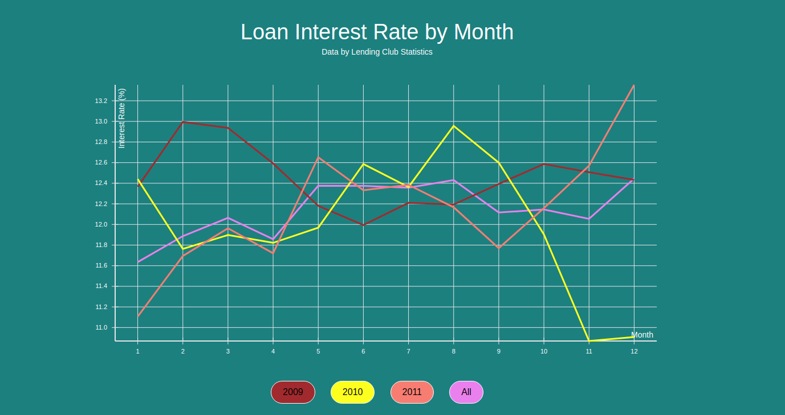

# Data Visualization using React

This app creates a simple visualization of the relationship between loan interest rates and month, across years between 2009 and 2011. As my first data visualization project, I decided to use a well-known library from Uber called `react-vis`.



### Technologies
This project incorporates a Ruby on Rails backend with PostgreSQL for storing the `.csv` data. React, HTML, and CSS are used for the frontend.

### How to Use
* Download the repo and run `rails s` and `npm start`. Open `localhost:3000` on your browser.
* Click on the buttons to change graph display.

### Basic Steps
1. Importing the Data

  * Planning to make the one graph, I deleted many unneeded columns.
  * Seeding the data from the `.csv` file takes place in `db/seeds.rb`.
  * The `csv` gem has the benefit of not keeping the entire `.csv` file in memory, but reading line by line.
  * Some columns were adjusted (ex. `int_rate` was changed to a float, and `issue_d` was changed to `year` and `month`)

2. Organizing the Backend

  * By grouping up the data in the backend, there is much less stress and waittime on the frontend. Averages were calculated by month and year (see `loans_controller.rb` and `loans/index.json.jbuilder`).
  * Loan data from before 2009 is filtered out (`app/controllers/api/loans_controller.rb`).

3. Implementing Visualization

  * The `react-vis` library's `XYPlot` was the core piece of the frontend. By supplying axes, dimensions, and arrays with the data, I was able to create linear graphs for each year.
  ```javascript
  <XYPlot
    xType="ordinal"
    width={1000}
    height={500}>
    <VerticalGridLines />
    <HorizontalGridLines />
    <XAxis title="Month"/>
    <YAxis title="Interest Rate (%)"/>
    <LineSeries
      data={dataArr}
      style={{stroke: 'violet', strokeWidth: 3}}/>
    ...
  </XYPlot>
  ```

### Improvements
If more time was allowed, I would incorporate the following:
* Add more buttons to group the data points (ex. grade, term, etc.).
* Add more interactivity to the graph. `react-vis` has interactive features that I was not able to explore here - for example, when hovering over a line at a certain year, I could display the average interest rate.
